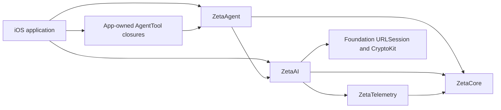

# iOS library support plan

## Goal

Enable iOS applications to consume Zeta's AI and agent functionality through the existing `ZetaAI` and `ZetaAgent` SwiftPM products.
Support iOS 17 or newer while preserving the existing macOS 14 command-line product and Pi compatibility contracts.
Treat `ZetaCore` and `ZetaTelemetry` as supported transitive iOS dependencies because they are required by `ZetaAI` and `ZetaAgent`.

## Context

`Package.swift` currently declares only macOS 14.
A baseline `xcodebuild` of `ZetaAgent` for generic iOS succeeds when the deployment target is overridden to iOS 17, including `ZetaCore`, `ZetaTelemetry`, and `ZetaAI`.
Without that override, Xcode selects iOS 12 and compilation fails because the libraries use Swift concurrency APIs that require iOS 13 or newer.
The current package-wide test scheme also tries to compile macOS-only products such as `ZetaTools`, `ZetaResources`, and `ZetaPluginAPI`, so it cannot serve as the iOS test boundary.
A disposable external Swift package that names the local dependency `Zeta` successfully imports the two products, loads the bundled catalog, and runs an agent test on the iOS Simulator when the deployment target is overridden to iOS 17.
The supported iOS surface therefore needs a focused consumer fixture and focused CI gate rather than a claim that every Zeta product supports iOS.

## Architecture

The iOS application owns its UI, lifecycle, credential acquisition, sandbox access, and tool implementations.
`ZetaAgent` owns the agent loop, events, tool dispatch, retries, cancellation, and state.
`ZetaAI` owns provider requests, streaming, model data, payload conversion, bundled catalog resources, and WebSockets.
No iOS code path depends on the CLI, terminal, process, package, plugin-host, Unix transport, or shell modules.

## Non-Goals

- Building a Zeta iOS application or UI framework.
- Porting the `zeta` or `pi` executables to iOS.
- Supporting shell commands, child processes, terminal TUI, executable plugins, package installation, Unix transport, or unrestricted filesystem tools on iOS.
- Declaring every SwiftPM product in this repository to be iOS-compatible.
- Adding `ZetaAuth`, `ZetaBedrock`, session persistence, or SQLite to the initial iOS support contract.
- Publishing a binary framework, App Store artifact, tag, or release as part of this work.
- Changing Pi wire formats, generated compatibility fixtures, the model catalog, or the pinned Pi source baseline.

## Assumptions

- The minimum supported deployment target is iOS 17.
- Consumers use Swift 6.2 or newer and add the `ZetaAI` and `ZetaAgent` products through Swift Package Manager.
- Consumers may add `ZetaCore` directly when their tool implementations name `JSONValue` or `JSONSchema` APIs.
- Consumers inject API keys or short-lived bearer tokens explicitly and do not rely on process environment variables in production iOS applications.
- Provider calls run while the application has execution time, and background execution is controlled by the host application rather than Zeta.

## Risks

- SwiftPM platform declarations apply to the package, not individual products, so unsupported macOS-only products may appear selectable to an iOS consumer.
- The public documentation and focused CI matrix must state and enforce the exact supported product closure to avoid implying full-package portability.
- Long-lived provider credentials embedded in a distributed application can be extracted by users or attackers.
- The security guide must recommend a backend or short-lived token flow and must not include real credentials in examples or tests.
- Simulator tests do not replace a generic iPhoneOS build because some availability and linking failures are device-SDK-specific.
- A generic iPhoneOS build does not exercise runtime resource lookup, so the consumer fixture must load `BuiltinModelCatalog.bundled()` in an iOS Simulator test.
- iOS application suspension may interrupt streams or agent runs, so cancellation and foreground-lifecycle limits must be documented without promising background completion.

## Plan

- [x] Add `docs/adr/0002-ios-library-platform.md` to define iOS 17 as the minimum target, name `ZetaCore`, `ZetaTelemetry`, `ZetaAI`, and `ZetaAgent` as the supported iOS module closure, preserve all macOS product commitments, and record the package-level platform-advertisement limitation; verified by `uv run python scripts/check-docs.py` (`documentation verified: 4847 source lines`) and `git diff --check` on 2026-08-29.
- [x] Update `Package.swift` to declare `.iOS(.v17)` alongside `.macOS(.v14)` without adding dependencies or changing product names; verified from `/tmp/zeta-ios-package.json` that the manifest reports macOS 14, iOS 17, zero dependencies, and automatic `ZetaAI` and `ZetaAgent` libraries on 2026-08-29.
- [x] Build the `ZetaAI` and `ZetaAgent` dependency closure for `generic/platform=iOS` and `generic/platform=iOS Simulator` with complete strict concurrency and warnings as errors; both `xcodebuild` commands reported `BUILD SUCCEEDED`, and `rg` found no `Darwin`, `AppKit`, `UIKit`, or `Process` usage in the supported source closure on 2026-08-29.
- [x] Treat the first clean device and simulator builds as a safe checkpoint; the checkpoint passed without source changes or expansion into a macOS-only module, with logs retained at `/tmp/zeta-ios-device-build.log` and `/tmp/zeta-ios-simulator-build.log` on 2026-08-29.
- [x] Add `Examples/iOSLibraryConsumer` as an independent iOS 17 Swift package that depends on the repository through `.package(name: "Zeta", path: "../..")`, imports the public `ZetaAI` and `ZetaAgent` products as an external consumer would, and demonstrates constructing an `Agent` with an explicitly injected credential and an app-owned tool closure; `swift package describe --type json` showed only those two Zeta products, and the generic iPhoneOS consumer build reported `BUILD SUCCEEDED` on 2026-08-29.
- [ ] Add synthetic iOS consumer tests that load the bundled model catalog, stream a deterministic `FauxProvider` response through `Agent`, observe terminal agent events, and execute an app-owned tool closure without network access or credentials; verify the generated `ZetaIOSLibraryConsumer` scheme passes on an available iOS Simulator with zero failures and zero skips.
- [ ] Add `scripts/check-ios-libraries.sh` to assert the iOS 17 manifest contract, build the supported products for iPhoneOS, build the external consumer for the iOS Simulator SDK, select an available simulator without relying on a fixed device name, run the focused consumer tests, retain concise logs or an `.xcresult`, and restore any simulator state that the script changed; verify a nonzero exit is returned for any failed or unavailable required check.
- [ ] Add an `iOS libraries` CI job to `.github/workflows/ci.yml` using the repository's existing immutable action revisions, pinned Swift and uv versions, and `scripts/check-ios-libraries.sh`; verify the job uploads its diagnostic artifacts on failure and does not weaken or duplicate the existing macOS repository, strict-build, unit-test, or sanitizer gates.
- [ ] Update `README.md`, `docs/user/README.md`, and `docs/api/README.md`, and add `docs/user/ios-libraries.md` with SwiftPM product-selection instructions, a compiling AI and agent example, `MainActor` guidance for UI updates, explicit credential injection, cancellation behavior, app-owned tool boundaries, and the exact unsupported products; verify every documented symbol and call shape compiles in `Examples/iOSLibraryConsumer`.
- [ ] Update `docs/user/security.md`, `docs/development/testing.md`, and the compatibility platform wording where needed to distinguish the macOS Pi-compatible executable from the additional iOS library surface; verify the docs warn against shipping long-lived provider secrets and do not claim iOS binary or full-package compatibility.
- [ ] Run `swift format lint --strict --recursive Sources Tests Examples Package.swift`, `uv run python scripts/generate-api-docs.py --check`, and `ZETA_API_BASELINE=HEAD scripts/check-swift-gates.sh`; verify formatting, generated API documentation, public API compatibility, macOS strict builds, and macOS tests all pass before the final repository gate.
- [ ] Run `scripts/check-ios-libraries.sh` followed by `scripts/check-repository.sh`; verify the iPhoneOS build, iOS Simulator consumer tests, generated-file checks, docs checks, license checks, secrets checks, macOS builds, and macOS tests all pass, and report any unavailable optional oracle interoperability check as an explicit non-passing skip rather than evidence for iOS support.
- [ ] Inspect `git diff --check`, `git status --short`, and the complete final diff; verify only the approved manifest, portable-library changes if required, iOS consumer fixture, checks, CI, ADR, and documentation are present, and verify generated compatibility inventory, fixtures, model catalog files, and release scripts remain unchanged unless a separately approved discovery requires otherwise.

## Rollback / Recovery

- [ ] If the manifest change breaks macOS consumers or package resolution, revert the iOS platform declaration, consumer fixture, iOS gate, CI job, and support claims together, then verify `scripts/check-repository.sh` restores the prior macOS-only state.
- [ ] If a provider API is unavailable on iOS 17, prefer an injected protocol-backed adapter inside the existing supported module boundary; if that changes public behavior or dependencies, leave the affected plan item unchecked and request approval for a revised ADR and plan.
- [ ] If simulator selection or boot fails in CI, preserve the `.xcresult` and environment report, clean up only simulators created or booted by the gate, and keep the CI requirement failing until the infrastructure issue is verified rather than converting it to a silent skip.

## Completion Checklist

- [ ] `swift package dump-package` reports macOS 14 and iOS 17, zero external dependencies, and unchanged `ZetaAI` and `ZetaAgent` library product names.
- [ ] `ZetaCore`, `ZetaTelemetry`, `ZetaAI`, and `ZetaAgent` compile for generic iPhoneOS and the iOS Simulator SDK with Swift 6 complete strict concurrency and warnings as errors.
- [ ] The independent iOS consumer imports the public products without importing or linking a macOS-only Zeta module.
- [ ] The iOS Simulator consumer tests pass catalog resource loading, AI streaming, agent event settlement, and app-owned tool execution with synthetic data.
- [ ] CI contains a required iOS library job with retained failure diagnostics and no publishing, signing, notarization, or release side effects.
- [ ] User and API documentation state iOS 17, the supported product closure, installation and usage steps, app lifecycle limits, unsupported macOS functionality, and safe credential handling.
- [ ] Existing macOS strict builds, tests, sanitizers where run, API checks, examples, and repository gates remain passing.
- [ ] No external Swift dependency, production credential, provider payload containing user data, generated compatibility change, or release artifact is introduced.
- [ ] The final diff is focused, passes `git diff --check`, and contains no unrelated or unexplained file changes.
